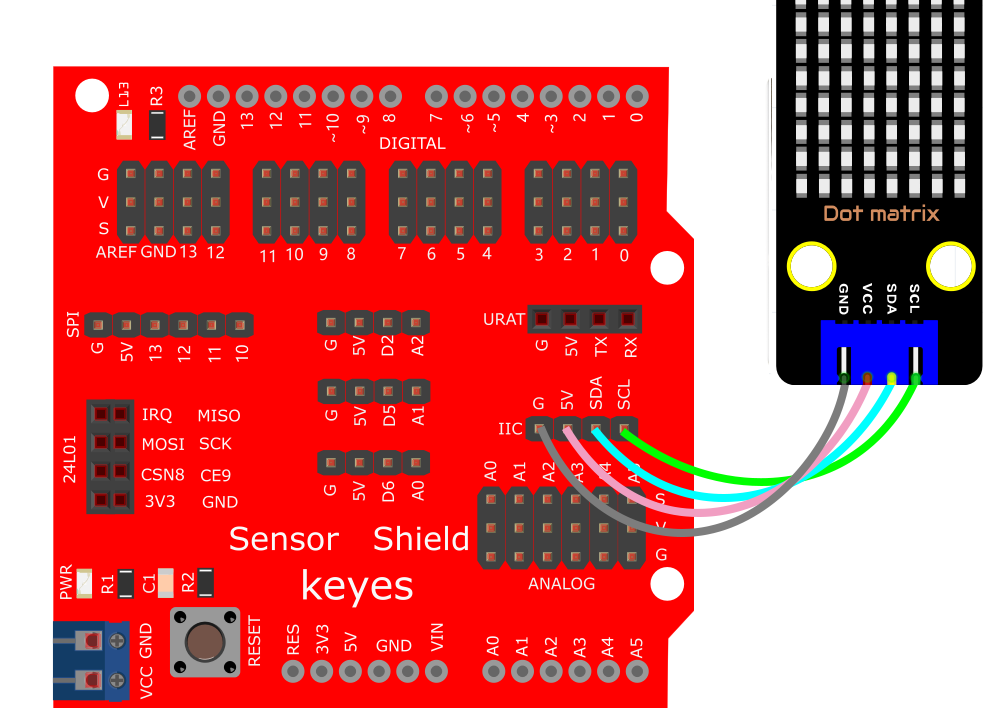
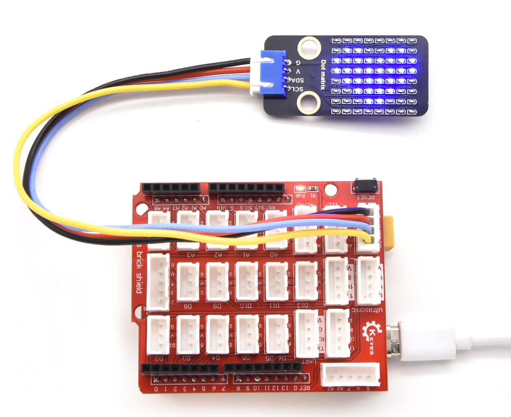

# Arduino


## 1. Arduino简介  

Arduino是一种开源的电子原型平台，使用易于使用的软件和硬件。它主要由一个基于微控制器的开发板以及一个集成开发环境（IDE）组成，用户可以通过编写简单的代码控制硬件。Arduino广泛应用于教育、艺术、机器人等多个领域，适合从初学者到专业开发者的各类用户。Arduino的特点包括低成本、易于使用和强大的社区支持，使得其在爱好者和教育界中非常流行。  

Arduino使用C和C++编程语言，配备大量库，能够轻松访问多种传感器、执行器和通信模块。通过Arduino，用户可以进行各种项目，例如自动化控制、环境监测以及无线通信等。Arduino的灵活性和扩展性使得它在开发原型和产品方面成为了一个理想的选择。  

## 2. 接线图  

  

## 3. 测试代码  

```cpp  
#include <Matrix.h> // 点阵的库  

Matrix myMatrix(SDA, SCL);  

uint8_t LEDArray[8];  

const uint8_t LedArray1[8] PROGMEM = {0x00, 0x18, 0x3c, 0x7e, 0xff, 0xff, 0x66, 0x00}; // 心形图案  

void setup() {  
    myMatrix.begin(0x70); // IIC地址  
    myMatrix.clear(); // 清除显示  
    myMatrix.setBrightness(5); // 亮度5, 范围0~15  
}  

void loop() {  
    memcpy_P(&LEDArray, &LedArray1, 8);  
    for (int i = 0; i < 8; i++) {  
        for (int j = 0; j < 8; j++) {  
            if ((LEDArray[i] & 0x01))  
                myMatrix.drawPixel(j, i, 1);  
            else  
                myMatrix.drawPixel(j, i, 0);  
            LEDArray[i] = LEDArray[i] >> 1;  
        }  
    }  
    myMatrix.write(); // 显示  
}  
```  

## 4. 代码说明  

### 4.1 导入库  

在代码的开头，我们通过`#include <Matrix.h>`导入了点阵显示所需的库，确保能够使用该库提供的功能。  

### 4.2 心形图案数据  

心形图案是通过字节数组`LedArray1`进行定义的。该数组的数据转换为二进制后，填入8x8的表格中，可以清晰地看到心形的形状：  

|   |   |   |   |   |   |   |   |  
|---|---|---|---|---|---|---|---|  
| 0 | 0 | 0 | 0 | 0 | 0 | 0 | 0 |  
| 0 | 0 | 0 | 1 | 1 | 0 | 0 | 0 |  
| 0 | 0 | 1 | 1 | 1 | 1 | 0 | 0 |  
| 0 | 1 | 1 | 1 | 1 | 1 | 1 | 0 |  
| 1 | 1 | 1 | 1 | 1 | 1 | 1 | 1 |  
| 1 | 1 | 1 | 1 | 1 | 1 | 1 | 1 |  
| 0 | 1 | 1 | 0 | 0 | 1 | 1 | 0 |  
| 0 | 0 | 0 | 0 | 0 | 0 | 0 | 0 |  

### 4.3 显示逻辑  

在`loop()`函数中，首先通过`memcpy_P()`将心形图案的数据复制到`LEDArray`。接着，使用双重循环遍历`LEDArray`的每个字节，并通过`myMatrix.drawPixel()`方法控制每个像素的点亮或熄灭。最后，通过调用`myMatrix.write()`将这些设置应用于显示器。  

## 5. 测试结果  

成功烧录测试代码并按照接线图连接电路后，上电后，点阵将显示出一个心形图案。  




