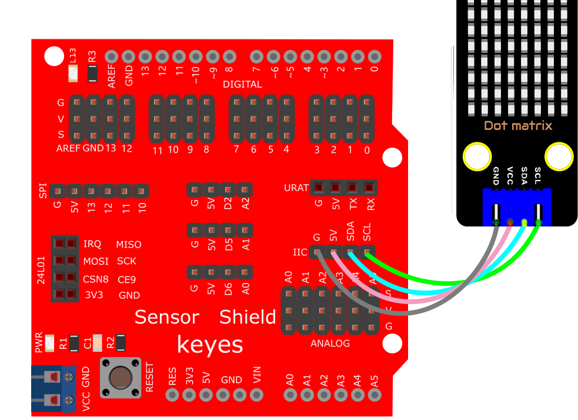
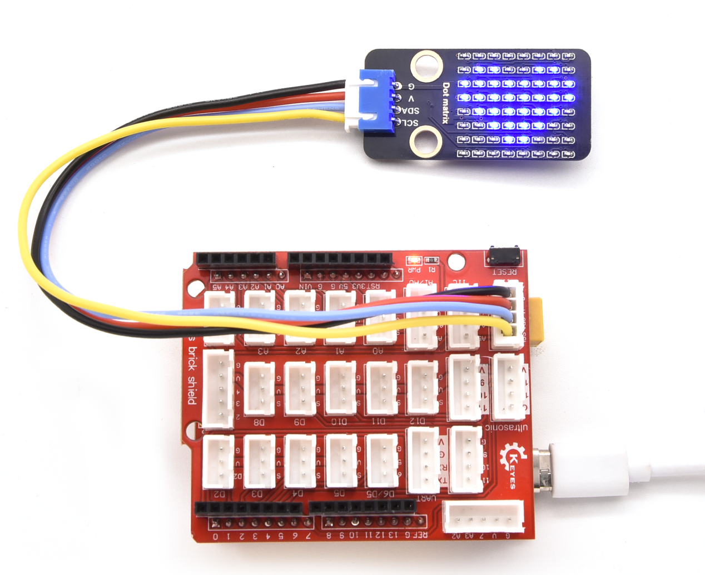

# KidsBlock

## 1. KidsBlock简介  

KidsBlock是一款针对儿童和初学者设计的可视化编程工具，旨在通过游戏化的方式激发孩子们的编程兴趣。它通过简单的拖放界面，使用户能够快速创建交互式项目，帮助他们理解编程的基本概念和逻辑。KidsBlock支持多种平台和模块，包括Arduino，用户可以通过可视化的编程模块与物理世界进行互动。  

该平台特别适合教学用途，结合了创意和技术，鼓励儿童在实践中学习和探索。KidsBlock提供丰富的教程和实例，帮助用户开展各种项目，如游戏开发、机器人控制和传感器应用等，让孩子们在轻松愉快的环境中学习编程技能。  

## 2. 接线图  

  

## 3. 测试代码  

  

## 4. 代码说明  

### 4.1 添加HT16K33点阵模块  

在使用KidsBlock进行项目时，首先需要添加HT16K33点阵模块。在这个模块中，IIC通信地址被固定为0X70（112），因此不需要进行地址修改。同时，IIC接口引脚也不需要更改，默认配置即可。  

  

### 4.2 选择图案  

在点阵单元下，找到并选择心形图案模块，用于展示。  

  

  

## 5. 测试结果  

成功上传测试代码并根据接线图连接好电路后，上电后，点阵将显示一个心形图案。  

