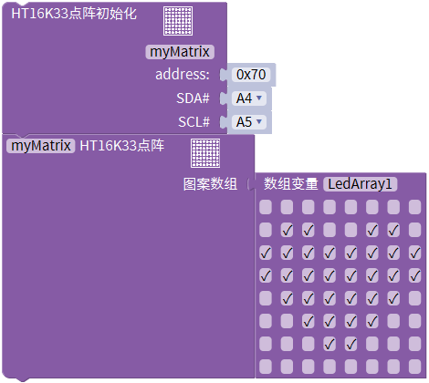
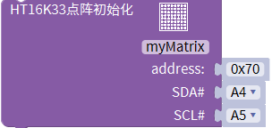
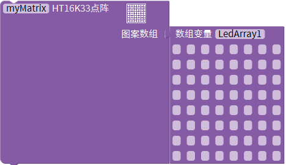

# Mixly

## 1. Mixly简介  

Mixly是一款基于Blockly的可视化编程工具，旨在简化编程学习过程，特别适合初学者和儿童。用户通过拖放积木的方式创建程序，从而降低了编程语言的复杂性，使得编程更加直观和易于理解。Mixly支持多种编程平台，包括Arduino，用户可以使用其丰富的图形化模块来实现各种功能。  

Mixly提供了友好的用户界面，用户可以通过简单的图形化积木组合来完成复杂的编程任务，同时支持代码的生成和导出，以便于用户在Arduino IDE中进行进一步的编辑和上传。其广泛的应用案例和在线社区，也为用户提供了丰富的学习资源和项目分享平台，促进了编程教育的发展。  

## 2. 接线图  

  

## 3. 测试代码  

  

## 4. 代码说明  

### 4.1 导入库文件  

在使用Mixly进行项目开发时，首先需要导入对应的库文件，例如keyes sensor。这一步骤确保了项目能正确获得所需的功能模块。  

在库的“显示模块”单元中找到HT16K33点阵模块，如下图所示：  

  

IIC通信地址已固定为0X70，因此无需更改。同时，IIC接口引脚也不用进行修改，保持默认设置即可。  

### 4.2 功能选择  

在同一单元下，找到可用的功能模块。我们可以通过鼠标点击模块上面的方格来选择相应的功能。当选中某一功能时，相应的指示灯将会亮起，其余的灯则处于熄灭状态。  

  

## 5. 测试结果  

成功烧录测试代码并按照接线图连接电路后，上电后，点阵将显示出一个心形图案。  

