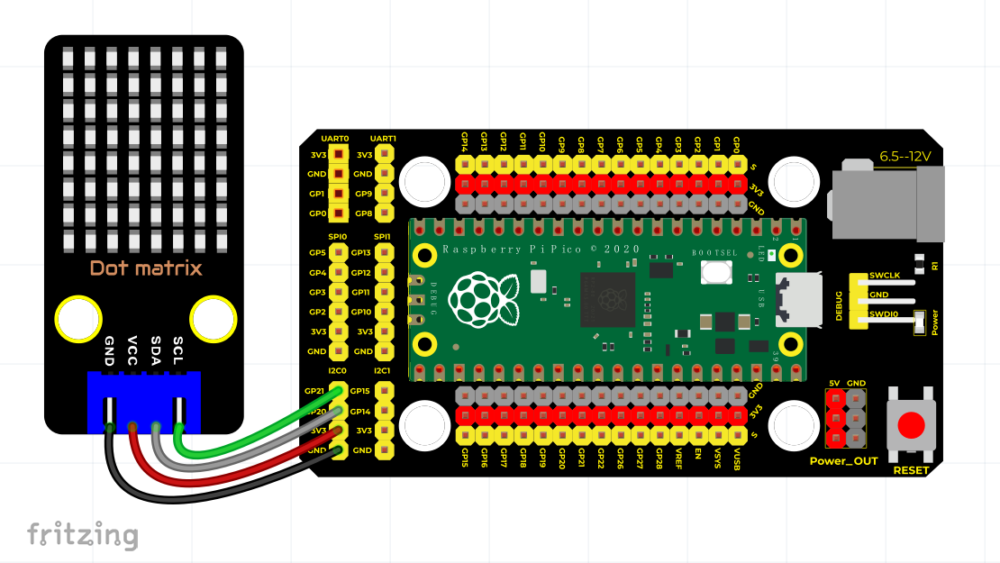

# Python


## 1. Python简介  

Python是一种高级的、通用的编程语言，以其简洁的语法和广泛的应用而受到欢迎。它支持多种编程范式，包括面向对象编程、过程式编程和函数式编程。Python的设计哲学强调代码的可读性，使用缩进来定义代码块，使得代码结构清晰。Python拥有强大的标准库，以提供丰富的现成功能，能够用于Web开发、数据分析、人工智能、科学计算等多个领域。  

由于其广泛的社区支持和大量的第三方库，Python成为了许多新手和专业开发者的首选语言。它可以在各种操作系统上运行，并且与多种编程语言和平台兼容，使其适用于各种应用场景。  

## 2. 接线图  

  

## 3. 测试代码  

```python  
import machine  
import time  
import json  
import matrix_fonts  
from ht16k33_matrix import ht16k33_matrix  

# I2C配置  
clock_pin = 21  
data_pin = 20  
bus = 0  
i2c_addr_left = 0x70  
use_i2c = True  

def scan_for_devices():  
    i2c = machine.I2C(bus, sda=machine.Pin(data_pin), scl=machine.Pin(clock_pin))  
    devices = i2c.scan()  
    if devices:  
        for d in devices:  
            print(hex(d))  
    else:  
        print('no i2c devices')  

if use_i2c:  
    scan_for_devices()  

left_eye = ht16k33_matrix(data_pin, clock_pin, bus, i2c_addr_left)  

def show_char(left):  
    if use_i2c:  
        left_eye.show_char(left)  

def scroll_message(font, message='hello', delay=0.05):  
    left_message = ' ' + message  
    right_message = message + ' '  
    length = len(right_message)  
    char_range = range(length - 1)  

    for char_pos in char_range:  
        right_left_char = font[right_message[char_pos]]  
        right_right_char = font[right_message[char_pos + 1]]  
        left_left_char = font[left_message[char_pos]]  
        left_right_char = font[left_message[char_pos + 1]]  

        for shift in range(8):  
            left_bytes = [0, 0, 0, 0, 0, 0, 0, 0]  
            right_bytes = [0, 0, 0, 0, 0, 0, 0, 0]  

            for col in range(8):  
                left_bytes[col] = left_bytes[col] | left_left_char[col] << shift  
                left_bytes[col] = left_bytes[col] | left_right_char[col] >> (8 - shift)  
                right_bytes[col] = right_bytes[col] | right_left_char[col] << shift  
                right_bytes[col] = right_bytes[col] | right_right_char[col] >> (8 - shift)  

            if use_i2c:  
                left_eye.show_char(left_bytes)  

            time.sleep(delay)  

while True:  
    show_char(matrix_fonts.textFont1['A'])  
    time.sleep(1)  
    show_char(matrix_fonts.textFont1['B'])  
    time.sleep(1)  
    show_char(matrix_fonts.textFont1['C'])  
    time.sleep(1)  
    scroll_message(matrix_fonts.textFont1, ' Hello World ')  
```  

## 4. 代码说明  

### 4.1 导入模块  

首先，我们需要导入点阵显示模块和相关的库，包括`matrix_fonts`模块，它包含字符的模版文件。通过这些导入，我们可以使用各类字符和功能进行显示。  

### 4.2 字符显示与滚动显示  

- `show_char()`函数用于显示单个字符，例如`show_char(matrix_fonts.textFont1['A'])`就是显示字母"A"。  
- `scroll_message(font, message='hello', delay=0.05)`函数用于实现翻滚显示效果，其中`delay`参数控制滚动的速度，`message`参数指定需要滚动显示的字符串。  

## 5. 测试结果  

按照接线图连接好线并运行测试代码后，点阵将依次显示"A"、"B"和"C"（每个字符显示一秒），然后滚动显示"Hello World"文本，并不断循环此操作。


